<div align="center">

<picture>
  <source media="(prefers-color-scheme: dark)" srcset="docs/assets/art/hero-dark.svg">
  <source media="(prefers-color-scheme: light)" srcset="docs/assets/art/hero-light.svg">
  
</picture>

# <picture><source media="(prefers-color-scheme: dark)" srcset="docs/assets/logo-dark.svg"></picture>

### Trace the effect, not just the call.

**Open, evidence-graded observability from agent actions to Kubernetes effects.**

[**🌐 effecttrace.github.io**](https://effecttrace.github.io/)

<a href="https://github.com/effecttrace/effecttrace" title="Star EffectTrace on GitHub"><picture>
  <source media="(prefers-color-scheme: dark)" srcset="docs/assets/art/star-dark.svg">
  
</picture></a>

[](LICENSE)
[](go.mod)
[](docs/upstream-compatibility.md)
[](docs/opentelemetry.md)
[](docs/mcp.md)
[](docs/prometheus.md)
<br>
[](https://github.com/effecttrace/effecttrace/actions/workflows/ci.yaml)
[](https://github.com/effecttrace/effecttrace/actions/workflows/e2e.yaml)
[](https://github.com/effecttrace/effecttrace/actions/workflows/codeql.yaml)
[](https://scorecard.dev/viewer/?uri=github.com/effecttrace/effecttrace)

[✨ Why](#why) · [🧭 Evidence model](#the-evidence-model) · [🏗️ Architecture](#architecture) · [🚀 Quick start](#quick-start) · [🎬 Demo](#demo) · [🧪 Experiments](#experiments-and-results) · [🔒 Security](#security-and-privacy) · [⚠️ Limitations](#limitations) · [📚 Docs](docs/README.md)

</div>

---

OpenTelemetry can show that an agent called `restart_workload`.
Kubernetes can show that Pods changed.
**EffectTrace connects those observations while keeping direct evidence separate from correlation.**

EffectTrace connects an observed action (an MCP tool call, or a human `kubectl` request seen in the audit log) to the Kubernetes mutation it made, the controller fan-out that followed, and the operational signals that changed, and every connection carries the class of evidence behind it. It answers one question honestly:

> **What changed after this action, and what evidence connects the action to each observed effect?**

<div align="center">
<picture>
  <source media="(prefers-color-scheme: dark)" srcset="docs/assets/art/terminal-dark.svg">
  
</picture>
<br><sub>Real output of <code>effecttrace explain</code> from the kind lab.</sub>
</div>

## Why

An agent can call a tool and a trace can show the tool invocation. The consequences arrive later and elsewhere: the Kubernetes API accepts a mutation, a controller reconciles it asynchronously, ReplicaSets and Pods come and go, and traffic, errors and latency move. Distributed traces usually stop at that boundary because controllers do not carry the original trace context.

Filling the gap with timestamps alone is dangerous: in a busy cluster *something* always changed in the last minute. EffectTrace therefore never presents temporal correlation as causation, refuses to attach changes it cannot connect structurally, and says so when two actions compete for the same change.

**What EffectTrace is not.** It is not a tracing backend, an MCP gateway, an AIOps or root-cause engine, or an LLM that guesses causality. OpenTelemetry already traces calls, Kubernetes audit already records API activity, object metadata already records ownership, and Prometheus already records metrics. EffectTrace replaces none of them; it **composes their evidence** into one effect graph.

## The evidence model

<div align="center">
<picture>
  <source media="(prefers-color-scheme: dark)" srcset="docs/assets/art/evidence-dark.svg">
  
</picture>
</div>

| Evidence | Line | Established by |
|---|---|---|
| **DIRECT** | solid | The tool's own Kubernetes request changed the object: the server-generated `Audit-ID` echoed to the instrumented client, the object UID and `resourceVersion` from the response, confirmed by the matching kube-apiserver audit event |
| **TRACE_LINK** | solid | OpenTelemetry parent/child: the Kubernetes client span descends from the MCP tool span (W3C `traceparent` in MCP `params._meta`) |
| **STRUCTURAL** | solid | Controller `ownerReferences` matched by UID (Deployment → ReplicaSet → Pod) inside the action's reconciliation window, with no competing action |
| **EVENT_REFERENCE** | solid | A Kubernetes Event references the object by UID |
| **TEMPORAL_CORRELATION** | dotted | A Prometheus signal changed inside the observation window. **Causation is not established.** |

Each relationship type admits exactly one evidence class, enforced by the data model. A node's grade is the weakest edge on its strongest path from the action: **ATTRIBUTED** or **CORRELATED**. Changes inside the windows of two actions are reported as **ambiguous** and attributed to neither; nearby changes without an ownership path are listed as **excluded**. See [docs/evidence-model.md](docs/evidence-model.md).

<div align="center">
<picture>
  <source media="(prefers-color-scheme: dark)" srcset="docs/assets/art/concurrent-dark.svg">
  
</picture>
</div>

## Architecture

<div align="center">
<picture>
  <source media="(prefers-color-scheme: dark)" srcset="docs/assets/art/pipeline-dark.svg">
  
</picture>
</div>

- **One Go collector**, read-only toward Kubernetes: `get/list/watch` on workloads, Pods, Services and Events. It never watches ConfigMaps or Secrets and holds no mutation rights.
- **Deterministic**: graphs are rebuilt from stored observations; the same input in any order produces byte-identical canonical JSON.
- **Bounded**: every queue and collection has a size and age limit; producers see explicit backpressure (HTTP 503 with `Retry-After`).
- **Portable output**: canonical JSON ([schema](schemas/effect-graph.schema.json)), and completed graphs exported as OTLP spans that **link** to the tool span rather than pretending to be its children.
- **`pkg/k8sinstrument`**: a reusable client-go `RoundTripper` that records the Audit-ID and object identity on the client span (JSON and Kubernetes protobuf responses), without recording bodies.

Read [docs/architecture.md](docs/architecture.md) and [docs/kubernetes-correlation.md](docs/kubernetes-correlation.md).

<div align="center">
<picture>
  <source media="(prefers-color-scheme: dark)" srcset="docs/assets/art/rollout-dark.svg">
  
</picture>
</div>

## Quick start

Requirements: Go (see `go.mod`), `kubectl`, and Docker or Podman. No cloud account, LLM API key or SaaS backend is needed.

```bash
git clone https://github.com/effecttrace/effecttrace && cd effecttrace
make demo-up      # kind cluster "effecttrace-lab": shop workload, OTel Collector, Prometheus, EffectTrace, demo tool server
make demo-run     # scripted agent acts; EffectTrace explains each effect graph
make demo-down    # deletes only the effecttrace-lab cluster
```

The lab writes its credentials to `.lab/kubeconfig`; your kubeconfig and current context are never modified. Explain any action yourself:

```bash
./bin/effecttrace actions --server http://127.0.0.1:18080
./bin/effecttrace explain --server http://127.0.0.1:18080 --trace-id <trace-id> --verbose
./bin/effecttrace graph   --server http://127.0.0.1:18080 --action <id> --format mermaid
```

To run the collector against your own cluster see [docs/deployment.md](docs/deployment.md); for every command and flag see [docs/cli.md](docs/cli.md) and [docs/api.md](docs/api.md).

## Demo

`make demo-run` is real end to end, with no recordings and no model:

1. A **scripted MCP client** calls `restart_workload(shop/checkout)` on a Go MCP server ([official Go SDK](https://github.com/modelcontextprotocol/go-sdk)), propagating trace context in `params._meta`.
2. EffectTrace links the tool span to the Kubernetes `PATCH`, the Deployment, the new ReplicaSet and Pods, the old Pods, the Events, and the latency change, each with its evidence class.
3. A **human scales another workload at the same moment** with `kubectl`: it stays in its own graph and appears only as an exclusion.
4. **Two agents act concurrently** on two workloads: their graphs do not mix.

Storyboard and expected output: [docs/demo.md](docs/demo.md). A browser replay of recorded experiments is on the [website](https://effecttrace.github.io/).

<div align="center">
<picture>
  <source media="(prefers-color-scheme: dark)" srcset="docs/assets/art/windows-dark.svg">
  
</picture>
</div>

## Experiments and results

The experiment suite runs against the kind lab and scores every effect graph against **ground truth derived from the harness's own actions and an independent watch of the cluster**, never from EffectTrace output. It covers single actions, human `kubectl` actions, failed rollouts, rollbacks, same-name recreation with a new UID, concurrent and same-workload actions, unrelated incidents injected without any Kubernetes change, missing trace context, collector, OTel Collector and kube-controller-manager restarts, missing audit and metrics sources, hostile telemetry, bursts, and offline replays with delays, reordering, corruption and different windows. Unsupported scenarios are reported as unsupported.

<!-- results:start (generated by make test-results; do not edit) -->
| Experiments | Pass | Fail | Error | Unsupported |
|---:|---:|---:|---:|---:|
| 42 | 40 | 0 | 0 | 2 |

| Live kind attribution (50 actions) | Value |
|---|---:|
| Direct precision / recall | 1.000 / 1.000 |
| Structural precision / recall | 1.000 / 0.938 |
| False attachments | 0 |
| Unrelated telemetry attachments | 0 |
| Claims on ambiguous changes | 0 |
| Concurrent-action separation | 6 / 6 |

<sub>Generated from [`test-results/`](test-results/) at commit `274f1c105b94` on Kubernetes v1.37.0 in a single-node kind cluster on a laptop. Not a production-scale measurement. Details: [docs/results.md](docs/results.md) · synthetic engine benchmarks: [docs/benchmarks.md](docs/benchmarks.md).</sub>
<!-- results:end -->

Every number above is generated from [`test-results/`](test-results/) by `make test-results`. Full per-scenario results: [docs/results.md](docs/results.md) · method: [docs/testing.md](docs/testing.md) · synthetic engine benchmarks: [docs/benchmarks.md](docs/benchmarks.md).

## Open-source ecosystem

EffectTrace builds only on open standards and projects it actually uses:

| Project | What EffectTrace uses it for | Governance |
|---|---|---|
| [Kubernetes](https://kubernetes.io/) | audit log, watch API, ownerReferences, Events; [kind](https://kind.sigs.k8s.io/) for the lab | CNCF graduated |
| [OpenTelemetry](https://opentelemetry.io/) | OTLP spans and links, Go SDK, Collector (core distribution) in the lab | CNCF graduated |
| [Prometheus](https://prometheus.io/) | range queries for telemetry signals; EffectTrace's own `/metrics` | CNCF graduated |
| [Model Context Protocol](https://modelcontextprotocol.io/) | trace context in `params._meta`; official Go SDK in the demo tool server and scripted client | Agentic AI Foundation (Linux Foundation) |

EffectTrace itself is an independent Apache-2.0 project; it is not hosted by or affiliated with any foundation.

## Security and privacy

<div align="center">
<picture>
  <source media="(prefers-color-scheme: dark)" srcset="docs/assets/art/privacy-dark.svg">
  
</picture>
</div>

Metadata, not payloads: prompts, tool arguments and results, request bodies, Secret and ConfigMap contents and tokens are never stored; human usernames are pseudonymized with a keyed hash; the lab audit policy never goes above `Metadata`. The collector uses least-privilege, read-only RBAC, separate from the demo actor's narrowly scoped mutation rights. EffectTrace is an observability system, **not** an authorization system: its graphs are evidence for people, not security decisions. See [docs/privacy.md](docs/privacy.md), [docs/threat-model.md](docs/threat-model.md), [docs/security-model.md](docs/security-model.md) and [SECURITY.md](SECURITY.md).

## Limitations

<div align="center">
<picture>
  <source media="(prefers-color-scheme: dark)" srcset="docs/assets/art/degraded-dark.svg">
  
</picture>
</div>

Temporal correlation is not causation. Missing telemetry yields incomplete graphs, reported as missing coverage. Concurrent changes to the same workload can be ambiguous. v0.1 follows controller ownership for Deployments, ReplicaSets, StatefulSets, DaemonSets and Jobs, but not Service selectors or ConfigMap consumers. State is in memory, and the lab is a laptop, not production. The full, explicit list is in [docs/limitations.md](docs/limitations.md).

## Contributing

Issues and pull requests are welcome; please read [CONTRIBUTING.md](CONTRIBUTING.md) and the [Code of Conduct](CODE_OF_CONDUCT.md). `make verify` runs everything CI runs without a cluster; `make demo-up && make test-e2e` runs the experiment suite. Planned work is in [ROADMAP.md](ROADMAP.md); governance in [GOVERNANCE.md](GOVERNANCE.md).

<div align="center">
<sub>Apache-2.0 · <a href="https://effecttrace.github.io/">effecttrace.github.io</a> · Temporal correlation does not prove causation.</sub>
</div>
