# ADR-006: Privacy defaults

Status: Accepted

<picture>
  <source media="(prefers-color-scheme: dark)" srcset="../assets/art/privacy-dark.svg">
  <source media="(prefers-color-scheme: light)" srcset="../assets/art/privacy-light.svg">
  
</picture>

## Context

EffectTrace sits next to some of the most sensitive data in a cluster: the
audit log (who did what), Pod specs (environment variables, commands, image
references), ConfigMaps and Secrets, and MCP tool calls whose arguments and
results may contain anything a user or model typed. Most of it is irrelevant
to recording evidence-graded relationships.

Data that is never collected cannot leak, be subpoenaed or be misused.

## Decision

Minimize at the source, by default:

1. **Kubernetes objects** are stripped by an informer transform before they
   enter the cache: identity, ownership, generation, replica counts and status,
   the revision annotation, the `pod-template-hash` label, and the Pod Ready
   condition. Nothing else.
2. **ConfigMaps and Secrets are never watched**, and the observer RBAC grants
   no access to them.
3. **Audit events** are reduced to request metadata; bodies, request URIs and
   source IPs are never retained. The recommended audit policy level is
   `Metadata`.
4. **Human usernames are pseudonymized** with HMAC-SHA-256 keyed by
   `EFFECTTRACE_IDENTITY_KEY` (`user:` + 12 hex digits); `system:*`
   identities stay verbatim because they identify components, not people.
   `--identity-mode=keep` is an explicit opt-out.
5. **User agents** are reduced to their first product token.
6. **Event messages** are sanitized and truncated to 256 bytes.
7. **MCP tool arguments and results are always dropped**, even if a producer
   opted in to sending them; only an allowlist of span attributes is kept.
8. **Recordings** contain only minimized records and are written with mode
   `0600`.

## Consequences

- Graphs remain useful for following action-to-effect relationships without
  exposing payloads.
- EffectTrace cannot answer questions that need payloads ("what value did the
  tool set?"). That is intentional.
- Pseudonyms are stable per key, so repeated actors are recognizable without
  identification. Without a configured key the collector generates a random
  per-process key: pseudonyms stay protected but change on restart.
- Adding a field to any record requires a privacy review
  ([development](../development.md#adding-a-source-or-attribute)).

## Alternatives considered

- **Keep everything, redact on output.** Rejected: data at rest in memory and
  recordings would still be sensitive, and every output path would need to be
  correct.
- **Unkeyed hashing of usernames.** Rejected: trivially reversible by hashing
  candidate names.
- **Dropping identities entirely.** Rejected: knowing whether two actions came
  from the same actor, and whether an actor is a controller or a person, is
  essential context.
- **Watching ConfigMaps for change detection.** Rejected: no ownership links
  ConfigMaps to Pods, so it would add exposure without adding structural
  evidence. A request that changes a ConfigMap is still visible as `DIRECT`.
