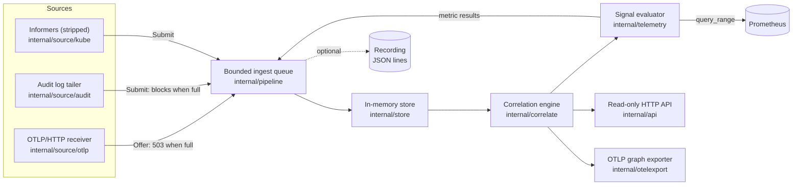

# Architecture

EffectTrace is a single Go collector plus a CLI. It composes signals that a
Kubernetes platform already produces (OpenTelemetry traces, the
kube-apiserver audit log, Kubernetes object metadata and Events, and
Prometheus metrics) and records evidence-graded relationships between an
action and what followed it. It replaces none of those systems: it is not a
tracing backend, a metrics store, an audit pipeline or an MCP gateway.

<picture>
  <source media="(prefers-color-scheme: dark)" srcset="assets/art/pipeline-dark.svg">
  <source media="(prefers-color-scheme: light)" srcset="assets/art/pipeline-light.svg">
  
</picture>

## Components

| Package | Responsibility |
| --- | --- |
| [`pkg/model`](../pkg/model) | Effect graph types, evidence classes, relationship-to-evidence mapping, validation, canonical JSON, grade computation. |
| [`pkg/semconv`](../pkg/semconv) | Attribute keys EffectTrace reads and writes. |
| [`pkg/k8sinstrument`](../pkg/k8sinstrument) | client-go transport wrapper that records the Audit-ID and response object metadata on Kubernetes client spans. |
| [`internal/source/otlp`](../internal/source/otlp) | OTLP/HTTP trace receiver (protobuf and JSON, optional gzip), relevance filter and attribute allowlist. |
| [`internal/source/audit`](../internal/source/audit) | Follows a kube-apiserver audit log file (JSON lines), including rotation. |
| [`internal/source/kube`](../internal/source/kube) | client-go informers with a strip transform; Events reduction. |
| [`internal/obs`](../internal/obs) | Normalized, privacy-minimized observation records shared by sources, store, recorder and replay. |
| [`internal/pipeline`](../internal/pipeline) | Single bounded queue and single writer to the store; optional recorder. |
| [`internal/store`](../internal/store) | Bounded, idempotent in-memory observation state with input validation. |
| [`internal/correlate`](../internal/correlate) | Action discovery, target resolution, windows, claimants, graph building. |
| [`internal/telemetry`](../internal/telemetry) | Evaluates configured PromQL signals against a baseline. |
| [`internal/otelexport`](../internal/otelexport) | Exports completed graphs as OTLP spans. |
| [`internal/api`](../internal/api) | Read-only HTTP API, health and readiness. |
| [`internal/render`](../internal/render) | Text, DOT and Mermaid rendering with output sanitization. |
| [`internal/metrics`](../internal/metrics) | EffectTrace's own Prometheus metrics. |
| [`internal/privacy`](../internal/privacy) | Pseudonymization, user-agent reduction, text sanitization. |
| [`cmd/effecttrace-collector`](../cmd/effecttrace-collector) | The collector binary. |
| [`cmd/effecttrace`](../cmd/effecttrace) | The CLI: query, explain, export, observe, replay, doctor. |

The [`demo/`](../demo) directory (scripted MCP agent, demo MCP tool server,
simulated shop workload) is not part of EffectTrace. It exists to drive the
lab and the experiments.

## Data flow

1. **Ingest.** Sources normalize what they observe into `obs.Record` values.
   The audit tailer and informers call `Submit`, which blocks while the queue
   is full. The OTLP receiver calls `Offer`, which never blocks; when the
   queue is full the receiver answers HTTP 503 with `Retry-After: 1`, so
   producers see explicit backpressure. The queue holds 10 000 records by
   default (`--queue-size`).
2. **Store.** A single goroutine applies records to the store. Every write is
   an idempotent keyed upsert: audit events by audit ID, spans by trace and
   span ID, object observations by UID, resourceVersion and watch type, Events
   by UID, metric results by action, signal and workload. Duplicates are
   counted and ignored. Invalid records are rejected and counted (see
   [threat model](threat-model.md)).
3. **Record (optional).** With `--record`, every applied record is appended as
   one JSON line, so the same investigation can be rebuilt offline with
   `effecttrace replay`.
4. **Correlate.** Graphs are built on demand. The engine builds a global index
   (actions, resolved mutations, claims by UID) once per store version and
   clock second and caches it; building a graph is a pure function of the
   store contents, the configuration and the current time.
5. **Evaluate telemetry.** Every 3 seconds, the collector asks the engine for
   actions whose reconciliation windows closed and whose telemetry window
   ended, evaluates the configured signals in Prometheus, and feeds the
   results back through the queue as `metric` records.
6. **Summarize and export.** In the same 3-second loop, the collector updates
   its own gauges and exports each newly `COMPLETE` graph once over OTLP, if
   an export endpoint is configured.
7. **Prune.** Every minute, records older than the retention period (2 h by
   default, `--retention`) are evicted.

## Store bounds

All collections are bounded by count and age, so a flood cannot exhaust
memory. Defaults from [`internal/store/store.go`](../internal/store/store.go):

| Bound | Default |
| --- | --- |
| Retention | 2 h |
| Audit requests | 50 000 |
| Spans | 100 000 |
| Objects (UIDs) | 50 000 |
| Observations per object | 64 (the first and the most recent are kept) |
| Events | 50 000 |
| Metric results | 20 000 |

Oldest records are evicted first. Objects are pruned by age only after they
are deleted.

## Determinism and replay

Because ingest is idempotent and graphs are built from sorted state, the same
observations produce byte-identical canonical JSON regardless of arrival
order or duplication. `effecttrace replay` loads a recording into a fresh
store and evaluates windows as of a configurable time after the last record
(`--close-after`, default 1 h). Replay is used for offline investigation and
by the replay experiments R01 to R07 ([testing](testing.md)).

## Process model

The collector is one process with these goroutines: the pipeline writer, one
per source, the periodic loop (telemetry, summaries, export, pruning) and the
HTTP API server. Any source that fails stops the collector with an error. The
API server answers `/readyz` only after the informers have synced (or
immediately when `--kube=none`).

The collector is designed to run as a **single replica**. State is in memory
only; a restart loses spans and in-memory state, then re-reads the audit log
(from its beginning, unless `--audit-from-end` is set) and relists objects.
Lab experiment L25 exercises this. See [limitations](limitations.md) and
[ADR-005](adr/005-storage-strategy.md).

## Interfaces

| Interface | Default | Notes |
| --- | --- | --- |
| HTTP API, `/metrics`, `/healthz`, `/readyz` | `:8080` (`--api-listen`) | [API](api.md), [Prometheus](prometheus.md) |
| OTLP/HTTP trace receiver | `:4318` (`--otlp-listen`), path `/v1/traces` | [OpenTelemetry](opentelemetry.md) |
| OTLP/HTTP graph export | disabled (`--otlp-export-endpoint`) | [OpenTelemetry](opentelemetry.md#exporting-effect-graphs) |
| Prometheus queries | disabled (`--prometheus-url` + `--signals`) | [Prometheus](prometheus.md) |
| Kubernetes API | in-cluster (`--kube`) | read-only: get, list, watch |
| Audit log | disabled (`--audit-log`) | read-only file |

## Related documents

- [Evidence model](evidence-model.md)
- [Deployment](deployment.md)
- [Security model](security-model.md)
- [Architecture decision records](adr/README.md)
