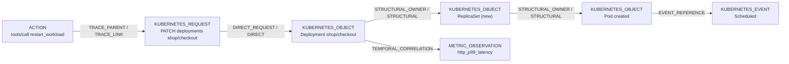

# Effect graph

An **effect graph** is one bounded investigation around one action: the
initiating operation, the Kubernetes requests it made, the objects those
requests changed, the controller-driven changes that followed inside the
observation windows, the Kubernetes Events that reference them and, when
configured, Prometheus signals evaluated over the same windows.

The Go types live in [`pkg/model`](../pkg/model). The canonical JSON encoding
is described by the JSON Schema
[`schemas/effect-graph.schema.json`](../schemas/effect-graph.schema.json)
(JSON Schema 2020-12). The schema version string is
`effecttrace.io/v1alpha1`.

<picture>
  <source media="(prefers-color-scheme: dark)" srcset="assets/art/rollout-dark.svg">
  <source media="(prefers-color-scheme: light)" srcset="assets/art/rollout-light.svg">
  
</picture>

## Shape

Edges are labelled `relationship / evidence`. The example is illustrative; the
real graph for a restart also contains the old ReplicaSet, the terminated Pods
and the controller Events.

## Top-level fields

| Field | Type | Notes |
| --- | --- | --- |
| `schemaVersion` | string | Always `effecttrace.io/v1alpha1`. |
| `id` | string | `g-` + action ID. |
| `status` | `OBSERVING` \| `SETTLING` \| `COMPLETE` | See [statuses](evidence-model.md#statuses). |
| `action` | object | The initiating action. |
| `windows` | array or null | Observation windows. |
| `nodes` | array | Always contains the action node. |
| `edges` | array or null | Evidence-graded relationships. |
| `ambiguities` | array, optional | Changes in the scope of more than one action. |
| `exclusions` | array, optional | Nearby observations deliberately not attached. |
| `coverage` | array | Per-source availability. |
| `notes` | array, optional | Caveats that apply to the whole graph. |

## Actions

| Kind | Discovered from | ID |
| --- | --- | --- |
| `MCP_TOOL_CALL` | an OTLP span with kind SERVER and `mcp.method.name = tools/call` | `mcp-<first 16 hex digits of the trace ID>-` |
| `KUBERNETES_API_CALL` | a successful, non-dry-run, mutating audit event that is not claimed by a tool call and not made by a controller identity or on an ignored resource | `k8s-<audit ID>` |

An action records `name`, `tool`, `actor`, `service`, `startedAt`, `endedAt`,
`trace` (for tool calls), `auditId` (for API calls), `outcome` (`ok` or
`error`) and `targets` (the objects its successful requests addressed).

For a tool call, `actor` is `mcp-client:<service.name>` when the tool span's
parent span belongs to a different service. For an audit-log action, `actor`
is the (possibly pseudonymized) Kubernetes username and `service` is the
reduced user agent. See [privacy](privacy.md).

## Nodes

| Node type | ID format | Carries |
| --- | --- | --- |
| `ACTION` | `action:<action ID>` | `span` (tool calls), `request` (API calls) |
| `KUBERNETES_REQUEST` | `request:<audit ID>` when an audit event confirms it, otherwise `request:span:<trace ID>:` | `request` (verb, resource, namespace, name, audit ID, user, user agent, status code, sources) |
| `KUBERNETES_OBJECT` | `k8s:<UID>`; `k8s:unresolved:<Kind>/<namespace>/<name>` when no UID could be resolved, with suffix `:ambiguous` when several objects carried the name | `object`, `change` |
| `KUBERNETES_EVENT` | `event:<Event UID>` | `event` (reason, type, sanitized note, controller, count) |
| `METRIC_OBSERVATION` | `metric:<signal>:<workload UID>` | `metric` (baseline, observed, direction, changed, samples) |
| `TRACE_SPAN` | reserved | not produced in v0.1 |

`request.sources` lists which independent observations confirm a request:
`otlp-client-span`, `kubernetes-audit`, or both.

### Object changes

`change.type` is one of:

| Type | Meaning |
| --- | --- |
| `MUTATED` | A request changed the object (with `generationFrom`/`generationTo`, `resourceVersion` and replica counts when known). |
| `CREATED` | The object appeared inside the window. `readyAt` is set when a Pod first reported Ready; `deletedAt` when the same action's window also saw it deleted (for example a Pod of a failed rollout). |
| `DELETED` | Deletion was observed (deletionTimestamp set or DELETED notification). |
| `SCALED` | A ReplicaSet's or StatefulSet's desired replicas changed (`replicasFrom` -> `replicasTo`). |
| `UNCHANGED` | The request succeeded but no resulting spec change, creation or deletion was observed; no controller fan-out is attributed. |

A `METRIC_OBSERVATION` node whose signal did **not** change is kept for
context but has no incoming edge, so it has no grade.

## Edges

Each edge has `id`, `from`, `to`, `relationship`, `evidence`, `reason`,
`source`, and optionally `observedAt`, `sourceRef`, `facts` and `rule`. The
evidence class is fixed by the relationship. `reason` is a human-readable
sentence written by the rule; `facts` are key/value identifiers that matched
(for example `object_uid`, `audit_id`, `owner_uid`, `regarding_uid`). The
complete list of rules is in the
[evidence model](evidence-model.md#attribution-rules).

`source` names where the evidence came from: `otlp`, `kubernetes-audit`,
`kubernetes-watch`, `kubernetes-events` or `prometheus`.

## Windows

`windows` lists the intervals considered:

- one `reconcile <Kind> <namespace>/<name>` window per mutation, with a reason
  that says whether it closed after a stable status, was capped, or is still
  open;
- `baseline` and `telemetry` windows when signals were evaluated.

See [ADR-004](adr/004-temporal-effect-windows.md) and
[Kubernetes correlation](kubernetes-correlation.md#observation-windows).

<picture>
  <source media="(prefers-color-scheme: dark)" srcset="assets/art/windows-dark.svg">
  <source media="(prefers-color-scheme: light)" srcset="assets/art/windows-light.svg">
  
</picture>

## Concurrency

<picture>
  <source media="(prefers-color-scheme: dark)" srcset="assets/art/concurrent-dark.svg">
  <source media="(prefers-color-scheme: light)" srcset="assets/art/concurrent-light.svg">
  
</picture>

Each action gets its own graph. Changes covered by competing actions become
ambiguities in each of their graphs; changes owned by another action become
exclusions. The rules are in the
[evidence model](evidence-model.md#the-single-claimant-rule).

## Canonical JSON and determinism

Building a graph is a pure function of the observation store and the
configuration. `EffectGraph.Canonicalize` normalizes every timestamp to UTC,
sorts nodes by ID, edges by `(from, to, relationship)`, facts, ambiguities,
exclusions and coverage, and recomputes grades. `MarshalCanonical` validates
and encodes with two-space indentation and HTML escaping. The same
observations therefore produce byte-identical JSON regardless of arrival order
or duplication (replay experiment R02 checks this).

`model.UnmarshalGraph` is the only supported way to read a graph. It:

- refuses documents larger than 16 MiB (`MaxGraphBytes`);
- rejects unknown fields and trailing data;
- validates node uniqueness, dangling edges, the presence of the action node,
  relationship/evidence agreement and edge IDs;
- recomputes grades, so a tampered `grade` field has no effect.

## Rendering

The CLI and the API render graphs as:

- `text`: the `explain` view (action header, effect tree with evidence tags,
  `NOT ATTRIBUTED (ambiguous)`, `EXCLUDED`, `WINDOWS`, `COVERAGE` and
  `IMPORTANT` notes);
- `dot`: Graphviz;
- `mermaid`: Mermaid flowchart;
- `json`: canonical JSON.

All graph-provided strings are stripped of control characters before text,
DOT or Mermaid output. See [CLI](cli.md) and [API](api.md).
