# Evidence model

<picture>
  <source media="(prefers-color-scheme: dark)" srcset="assets/art/evidence-dark.svg">
  <source media="(prefers-color-scheme: light)" srcset="assets/art/evidence-light.svg">
  
</picture>

EffectTrace records evidence-graded relationships between an initiating action
and what was observed after it. Every edge in an effect graph states two
things separately:

- the **relationship** it asserts (for example "this request mutated this
  object" or "this ReplicaSet controls this Pod"), and
- the **evidence class** that supports it.

The separation is the core design decision of the project
([ADR-001](adr/001-evidence-grading.md)). A relationship admits exactly one
evidence class, so timing alone can never be presented as direct or
structural evidence.

This document describes the rules as implemented in
[`pkg/model`](../pkg/model) and [`internal/correlate`](../internal/correlate).

## Evidence classes

| Evidence class | Meaning | Emitted in v0.1 | Typical source |
| --- | --- | --- | --- |
| `DIRECT` | The initiating operation itself performed the mutation, verified by request-level identifiers: the kube-apiserver Audit-ID, or the object UID and resourceVersion returned to the instrumented client. | yes | OTLP client span, Kubernetes audit log |
| `TRACE_LINK` | An OpenTelemetry parent/child (or span link) relationship. | yes (parent/child only) | OTLP |
| `STRUCTURAL` | Kubernetes object structure establishes the relationship: a controller `ownerReference`, matched by UID. | yes | Kubernetes watch |
| `EVENT_REFERENCE` | A Kubernetes Event references the object by UID. | yes | Kubernetes Events |
| `TEMPORAL_CORRELATION` | The observation happened inside a configured window. **Causation is not established.** | yes | Prometheus, audit log timing |
| `INFERRED` | Reserved for experimental heuristics. | **no** | none |

`DIRECT`, `TRACE_LINK`, `STRUCTURAL` and `EVENT_REFERENCE` are *attributable*
classes: they identify a relationship from authoritative identifiers rather
than from timing. `TEMPORAL_CORRELATION` is not attributable. `INFERRED` is
defined in the model so that the schema is stable, but EffectTrace v0.1 never
emits it.

## Relationships and their evidence

`model.Relationship.Evidence()` returns the only evidence class a relationship
may carry. `model.NewEdge` derives the evidence class from the relationship, so
callers cannot choose it, and `EffectGraph.Validate` rejects any edge whose
evidence does not match (`ErrEvidenceMismatch`). Graphs read from files or the
API go through the same validation in `model.UnmarshalGraph`.

| Relationship | Evidence class | Asserts | Emitted in v0.1 |
| --- | --- | --- | --- |
| `DIRECT_REQUEST` | `DIRECT` | An action or request mutated this object. | yes |
| `STRUCTURAL_OWNER` | `STRUCTURAL` | A controller owner controls this object. | yes |
| `TRACE_PARENT` | `TRACE_LINK` | A span descends from another span in the same trace. | yes |
| `TRACE_LINK` | `TRACE_LINK` | Two spans are related by an OpenTelemetry span link. | no (span links are retained on ingest but not correlated) |
| `EVENT_REFERENCE` | `EVENT_REFERENCE` | A Kubernetes Event references this object. | yes |
| `TEMPORAL_CORRELATION` | `TEMPORAL_CORRELATION` | An observation fell inside another node's window. Never implies causation. | yes |

Edge IDs are deterministic: `e-` followed by the first eight bytes (hex) of
SHA-256 over `from`, `to` and the relationship. `Validate` recomputes and checks
them.

## Path grades

Each node carries a **grade**: the weakest evidence on the *strongest* path
from the action node to it. A path is only as strong as its weakest edge.

| Grade | Meaning |
| --- | --- |
| `ATTRIBUTED` | Every edge on the path is `DIRECT`, `TRACE_LINK`, `STRUCTURAL` or `EVENT_REFERENCE`. |
| `CORRELATED` | At least one edge on the best available path is `TEMPORAL_CORRELATION`. |
| `INFERRED` | At least one edge on the best available path is `INFERRED` (not produced in v0.1). |
| *(absent)* | The node is not reachable from the action node, for example a metric observation that did not change. |

Grades are recomputed by `EffectGraph.Canonicalize` and are never taken from
input. The computation processes grades strongest first, so each node settles
at the best grade any path offers.

**Reverse traversal of `STRUCTURAL_OWNER`.** Ownership is known in both
directions, so grade computation also walks `STRUCTURAL_OWNER` edges from the
owned object to its owner. This matters when a tool deletes a Pod: the graph
has `action -> request -> Pod` (`TRACE_LINK`, `DIRECT`) and
`ReplicaSet -> Pod` (`STRUCTURAL`, as context). The ReplicaSet is reached from
the Pod in reverse, so it is graded `ATTRIBUTED`, and the replacement Pod it
created is reached from the ReplicaSet. Only `STRUCTURAL_OWNER` is traversed in
reverse; no other relationship is.

A consequence of the weakest-link rule: when a tool call is connected to a
Kubernetes request only by timing (see `request-received-during-tool-span`
below), every object below that request is `CORRELATED` in the tool call's
graph even though the edges below the request are `DIRECT` or `STRUCTURAL`.

## Attribution rules

Every edge records the rule that admitted it in `edge.rule`. Rule names are
constants in [`internal/correlate/build.go`](../internal/correlate/build.go).

| Rule | Relationship | Meaning |
| --- | --- | --- |
| `client-span-descends-from-tool-span` | `TRACE_PARENT` | A Kubernetes client span with a mutating `effecttrace.k8s.verb` descends from the MCP `tools/call` server span in the same trace, within at most 32 parent hops. Facts: `trace_id`, `client_span_id`, `parent_hops`. |
| `request-received-during-tool-span` | `TEMPORAL_CORRELATION` | A successful mutating request from the audit log was received while the tool span was running (widened by the skew tolerance), but no trace context or audit ID links it to the tool call. Used only when the tool call has no trace-linked request and the temporal fallback is enabled. It may have been made by another actor. |
| `uid-from-client-response` | `DIRECT_REQUEST` | The target UID (and resourceVersion) came from the response metadata returned to the instrumented client. |
| `uid-from-audit-object-ref` | `DIRECT_REQUEST` | The target UID came from the audit event's `objectRef.uid`. |
| `uid-resolved-by-name-at-request-time` | `DIRECT_REQUEST` | No UID was reported; it was resolved as the only object of that kind, namespace and name alive at request time (for a create: the only one created just after the request). This is the weakest `DIRECT` rule and the fact `uid_source` says so. |
| `target-not-observed` | `DIRECT_REQUEST` | The request is confirmed, but its target could not be resolved to a UID: the object was never observed by the watch, or more than one object carried that name around the request time. The target node is identified by name only, and no structural fan-out follows. |
| `controller-owned-change-in-window-single-claimant` | `STRUCTURAL_OWNER` | A descendant (by controller `ownerReference`, matched by UID) of a directly changed object was created, deleted or rescaled inside the mutation's reconciliation window, and no other action's scope covers that change. |
| `replacement-of-deleted-pod-in-window-single-claimant` | `STRUCTURAL_OWNER` | After a Pod deletion, a Pod created by the deleted Pod's controller owner inside the window, with no other claimant. |
| `controller-owner-of-directly-mutated-object` | `STRUCTURAL_OWNER` | Context only: an unchanged intermediate owner on the path to changed descendants, or the controller owner of a deleted Pod. It explains structure and is not a claim that the owner changed. |
| `event-references-object-in-window-single-claimant` | `EVENT_REFERENCE` | A Kubernetes Event regarding an object already in the graph, with an occurrence inside one of this action's windows and no competing claimant. Kubernetes aggregates repeated Events into one object whose count grows, so a series can span unrelated episodes; EffectTrace keeps the observed occurrences of each series and matches the earliest live occurrence in the window (relisted server timestamps only as a fallback). Facts: `regarding_uid`, `event_uid`. |
| `signal-changed-in-observation-window` | `TEMPORAL_CORRELATION` | A configured Prometheus signal for an in-scope workload differed from its baseline during the telemetry window. Correlation only. |

When the audit event and the instrumented client span both describe a request,
the `DIRECT_REQUEST` edge carries the facts `audit_id` and `audit_id_match`,
and its reason states that the audit event independently confirms the request.
See [Kubernetes correlation](kubernetes-correlation.md) for how that match is
checked.

## The single-claimant rule

Controllers act asynchronously. A new Pod that appears ten seconds after a
`kubectl rollout restart` and a new Pod that appears ten seconds after a
concurrent `kubectl scale` look the same. EffectTrace therefore attaches a
controller-driven change to an action only when exactly one *side* claims it.

For each lifecycle change (`CREATED`, `DELETED` or `SCALED`) of an object, the
engine computes the set of **claimants**:

1. **Direct claims first.** Any action whose request directly changed this
   object, with the same change type, at a time between the request (minus the
   skew tolerance) and the end of that mutation's window. If any direct claim
   exists, only direct claims count.
2. **Structural claims.** Otherwise, every action that changed a controller
   ancestor of the object (up to `MaxDepth` = 4 levels) and whose
   reconciliation window contains the change.
3. **Replacement claims.** For a created Pod, every action that deleted a
   sibling Pod of the same controller owner, when the creation falls inside
   that deletion's window.

The graph being built treats as "its own" the action itself and, for a
temporally linked request, that request's own API-call action. Then:

| Claimants | Outcome |
| --- | --- |
| only this graph's own action(s) | **attached** with a `STRUCTURAL_OWNER` (or `EVENT_REFERENCE`) edge |
| this graph's action and at least one other action | **ambiguity**: attached to none of them |
| another action directly changed the object | **exclusion**: "directly changed by another action" |
| other actions only | **exclusion**: "attributed to another action" |
| nobody, but the object is in a namespace this action touched | **exclusion**: "no ownership path to an object this action changed" |

Only mutations that actually changed something carry claims (see "No-op
requests" in [Kubernetes correlation](kubernetes-correlation.md)), and a
temporally linked request never gives the tool call ownership of the request's
effects: its own API-call action holds those claims
([ADR-008](adr/008-no-op-requests-and-change-level-claims.md)).

## Ambiguity

An ambiguity records a change that falls in the scope of more than one action.
It lists the candidate action IDs and a reason, for example "the change falls
in the reconciliation windows of more than one action that changed an owner of
this object". Ambiguous changes are claimed by **no** action. EffectTrace
prefers an honest "cannot tell" to a confident wrong answer.

The same rule applies to Events: an Event inside the windows of competing
actions becomes an ambiguity instead of an `EVENT_REFERENCE` edge.

## Exclusions

An exclusion records an observation deliberately **not** attached, with the
reason and, when known, the claiming action IDs. Exclusions make
false-attribution protection visible: an operator can see that a nearby change
was noticed and why it is not part of this graph. Exclusion kinds are the
change type (`CREATED`, `DELETED`, `SCALED`) or `METRIC` for telemetry of a
workload outside the action's structural scope. At most 50 exclusions are kept
per graph (`MaxExclusions`).

## Coverage

A graph states which sources it could rely on. Each `coverage` entry has
`source`, `available` and `detail`:

| Source | Available when |
| --- | --- |
| `kubernetes-audit` | every request of the action is confirmed by an audit event; the detail reports confirmed/total and source health |
| `otlp` | for an MCP tool call, the tool span was received; for an audit-log action, the receiver is healthy (the detail says no tool span exists) |
| `kubernetes-watch` | the watch is healthy and started before the action; otherwise "watch started after the action; earlier changes are unknown" |
| `kubernetes-events` | the Events informer is healthy |
| `prometheus` | at least one signal evaluation succeeded; the detail distinguishes "no metrics source configured", "no mutation to evaluate", "telemetry not evaluated yet" and "all signal queries failed" |

Missing coverage reduces what a graph can show; it never turns into a guess.

## Statuses

| Status | Meaning |
| --- | --- |
| `OBSERVING` | At least one observation window is still open. The graph can still grow. |
| `SETTLING` | All reconciliation windows have closed, a metrics source is configured, the action made at least one mutation, and telemetry has not been evaluated yet (and its telemetry window ended less than `MaxTelemetryAge`, 10 min, ago). |
| `COMPLETE` | All windows are closed and telemetry was evaluated (or no metrics source is configured, there was nothing to evaluate, or the telemetry window ended more than `MaxTelemetryAge` ago, for example before a restarted collector came up; coverage then says `not evaluated`). |

Only `COMPLETE` graphs are exported over OTLP. A graph can still change after
`COMPLETE` only if late-arriving observations for its windows are ingested
(for example a delayed audit stream); replay experiments R03 and R04 in
[testing](testing.md) cover this.

## Notes

Graphs carry fixed, human-readable notes when they apply:

- "Temporal correlation does not prove causation." whenever any
  `TEMPORAL_CORRELATION` edge exists;
- a note when ambiguities exist;
- a note when an MCP tool call has no Kubernetes request linked by trace
  context or audit ID;
- a note when a client span named an audit ID whose audit event disagrees on
  verb or object, so the audit event was not used as confirmation.

## Related documents

- [Effect graph](effect-graph.md): node and edge identifiers, canonical JSON.
- [Kubernetes correlation](kubernetes-correlation.md): how `DIRECT` and
  `STRUCTURAL` evidence is established and when windows close.
- [Limitations](limitations.md): what the evidence classes cannot tell you.
