# Limitations

EffectTrace v0.1 records evidence-graded relationships between an action and
what was observed after it. It follows supported Kubernetes structural
relationships and configured telemetry windows. Everything below is outside
what it can show, or shows only with reduced confidence. Read this page before
relying on a graph.

<picture>
  <source media="(prefers-color-scheme: dark)" srcset="assets/art/degraded-dark.svg">
  <source media="(prefers-color-scheme: light)" srcset="assets/art/degraded-light.svg">
  
</picture>

## What the evidence classes mean, and do not mean

- **Temporal is not causal.** A `TEMPORAL_CORRELATION` edge means a change
  was observed inside a window. It does not mean the action caused it. Lab
  experiment L20 injects a fault that, by construction, is unrelated to the
  action but falls inside its window; EffectTrace correctly attaches it as
  correlation only. Treat every `CORRELATED` node as a lead to investigate,
  never as a conclusion.
- **Attributed is not "intended" or "harmful".** An `ATTRIBUTED` Pod creation
  means the Pod is a controller-owned descendant of an object the action
  changed, created inside the action's window, with no competing claimant. It
  says nothing about whether the change was desired, correct or harmful.
- **No semantic understanding.** EffectTrace does not read tool arguments,
  prompts, manifests or diffs. It does not know what a change was meant to do.
- **No root-cause analysis.** EffectTrace does not use a language model, does
  not rank causes and does not explain incidents. It is not an AIOps system.

## Missing or partial telemetry

- **Missing trace context** between a tool server and its Kubernetes client
  means a tool call can reach its requests only through
  `TEMPORAL_CORRELATION` (L24). Missing context between agent and tool server
  loses the agent identity (L23).
- **Uninstrumented clients** produce no client span, so the response UID and
  resourceVersion are unavailable; DIRECT evidence then depends on the audit
  log and on name resolution.
- **Lost spans** (exporter drops, Collector restarts, 503 backpressure without
  retry) remove `TRACE_LINK` evidence. The same change is then attributed to
  the audit-log action instead of the tool call (L26).
- **Audit configuration dependence.** Audit-only actions (humans, controllers
  configured as actors) exist only if kube-apiserver writes an audit log with
  at least `Metadata` level for mutations and the collector can read the file.
  A policy that drops a resource or user hides those actions. Without the
  audit log, coverage reports it as missing (L27).
- **Managed control planes** often do not expose the audit log as a node file;
  v0.1 reads only the JSON-lines log backend.
- **Prometheus precision.** Signal values depend on the scrape interval, the
  rate window inside each query, the `query_range` step and the thresholds.
  Short spikes can be smoothed away or shifted by several seconds. If
  Prometheus is unavailable, coverage says so and no temporal edges appear
  (L28).

## Kubernetes semantics

- **Cross-controller context.** EffectTrace follows controller
  `ownerReferences` only. It does not follow Service-to-EndpointSlice,
  ConfigMap/Secret-to-Pod, HPA-to-target, PodDisruptionBudget, admission
  webhook or operator-specific relationships. A Service selector change has
  real traffic effects but gets only a `DIRECT` edge (L09); a ConfigMap change
  gets no fan-out (L08).
- **Asynchronous reconciliation.** Controllers act after the request returns.
  Effects are attributed only inside the reconciliation window (until a
  stable status plus 5 s, capped at 3 min by default). Effects after the
  window are missed (R05 shows the trade-off with a very short window), and
  effects of a workload that never stabilizes are attributed until the cap.
- **Concurrent same-workload ambiguity.** When two actions change the same
  workload within each other's windows, controller-driven changes after the
  second request are reported as ambiguities and attributed to neither (L16,
  L17, L32). EffectTrace does not try to split them.
- **Deletion removes current state.** After an object is deleted, only what
  was observed before is known. A watch started after an action cannot
  reconstruct earlier changes; coverage reports "watch started after the
  action".
- **UID continuity.** Identity is the UID. A delete-and-recreate with the same
  name is a different object (L22); EffectTrace never links them, even when a
  human would consider them "the same Deployment".
- **No-op detection is observational.** A change is counted only when the
  watch observed it near the request. A watch notification delayed by more
  than one second after request completion is not attributed to an audit-only
  request.
- **Name resolution.** Audit-only actions usually resolve their target UID by
  name at request time, because `objectRef.uid` is empty for PATCH and DELETE.
  This needs the watch, and refuses to guess when several objects carry the
  name.
- **Clock skew.** Windows combine kube-apiserver timestamps, the collector's
  observation times and, without audit confirmation, the client's clock.
  Skew beyond the 500 ms tolerance can move changes in or out of windows.
- **resourceVersion** is compared for equality only, never ordered.

## Coverage of workload types

The lab experiments cover Deployments, ReplicaSets, Pods, a ConfigMap and a
Service. They do **not** cover:

- Services and EndpointSlices as structural relationships;
- ConfigMap-to-Pod effects;
- HorizontalPodAutoscaler decisions (requires metrics-server; U01);
- GitOps controllers (U02), whose requests appear as API calls of their
  service account without commit-level context;
- StatefulSets, DaemonSets and Jobs. They are watched and their ownership is
  followed, and StatefulSets have their own stable-status rule, but DaemonSet
  and Job windows close when the change is observed rather than when the
  rollout or Job finishes, and no lab experiment exercises these kinds.

## Operational limits

- **In-memory only.** All state is in memory, bounded by count and by a 2 h
  retention. A restart loses spans and in-memory state (L25). Use `--record`
  and `effecttrace replay` for durable investigations.
- **Single replica.** The collector is not designed for horizontal scaling or
  high availability. Two replicas would each build their own, possibly
  different, graphs.
- **Graph construction cost.** Graphs are rebuilt on demand and for the
  periodic summary; very large clusters or very long retention increase CPU
  use. The [benchmarks](benchmarks.md) are synthetic and in-process.
- **Trust in telemetry producers.** Anyone who can reach the OTLP receiver can
  send spans. Audit agreement checks limit, but do not eliminate, the effect of
  forged spans ([threat model](threat-model.md)).
- **Protobuf metadata today, CBOR later.** `k8sinstrument` reads response
  metadata from JSON and Kubernetes protobuf. If client-go or an API server
  negotiates another encoding (for example CBOR), responses pass through
  without metadata and DIRECT evidence falls back to the audit log.
- **No built-in TLS or authorization** on the API.

## Evaluation limits

- **Local lab, not production scale.** Experiments run on a single-node kind
  cluster on a laptop with a small fictional workload. They demonstrate the
  rules, not production behaviour. See [results](results.md).
- **Ground truth has its own limits.** The harness cannot place changes during
  an in-flight competing request on either side of the API server's receive
  time; those are excluded from scoring ([testing](testing.md#ground-truth)).

## Related documents

- [Evidence model](evidence-model.md)
- [Roadmap](../ROADMAP.md)
- [Troubleshooting](troubleshooting.md)
