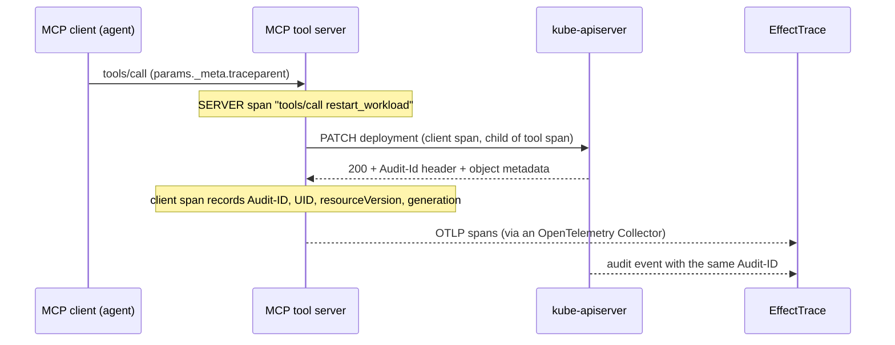

# OpenTelemetry

EffectTrace consumes OpenTelemetry traces and can export completed effect
graphs as OpenTelemetry spans. It is not a tracing backend: it keeps only the
few spans it correlates, only for the retention period, and only an allowlist
of their attributes. Send your traces to your backend as usual and add
EffectTrace as one more OTLP destination.

## Receiving traces

The collector serves an OTLP/HTTP trace receiver on `--otlp-listen`
(default `:4318`) at `POST /v1/traces`. An empty `--otlp-listen` disables it.

| Property | Behaviour |
| --- | --- |
| Encodings | `application/x-protobuf` and `application/json` (OTLP/JSON: hex IDs, integer enums, 64-bit integers as strings or numbers). Other content types get `415`. |
| Compression | `Content-Encoding: gzip` or none. Other encodings get `400`. |
| Size bound | 8 MiB (`MaxBodyBytes`), applied to the compressed body and again to the decompressed size. Larger bodies get `400`. |
| Spans per request | at most 10 000; a larger request is rejected with `400`. |
| Method | `POST` only; others get `405`. |
| Backpressure | When the ingest queue is full the receiver answers `503 Service Unavailable` with `Retry-After: 1`. OTLP exporters (including the OpenTelemetry Collector) retry such responses. |
| Partial success | Relevant spans that fail validation are counted in `partialSuccess.rejectedSpans` with the message "spans failed EffectTrace validation". |
| Server timeouts | 5 s to read headers, 30 s to read the request. |

There is no authentication on the receiver. Restrict who can reach it with
network policy; see the [security model](security-model.md).

### Which spans are kept

A span is **relevant** when either:

- `mcp.method.name` equals `tools/call` (a tool invocation), or
- it carries `effecttrace.k8s.verb` (a Kubernetes client span written by
  [`pkg/k8sinstrument`](../pkg/k8sinstrument)).

All other spans are dropped silently and do not count as rejected. Relevant
spans keep their trace ID, span ID, parent span ID, name, kind,
`service.name` (from the resource), start and end time, error status and up to
16 span links, plus only these attributes:

| Attribute | Origin |
| --- | --- |
| `mcp.method.name`, `mcp.protocol.version` | OpenTelemetry MCP semantic conventions |
| `gen_ai.tool.name`, `gen_ai.operation.name` | OpenTelemetry GenAI semantic conventions |
| `jsonrpc.request.id` | OpenTelemetry JSON-RPC semantic conventions |
| `error.type` | OpenTelemetry general conventions |
| `http.request.method`, `http.response.status_code` | OpenTelemetry HTTP conventions (stable) |
| `effecttrace.k8s.*` | EffectTrace ([semantic conventions](semantic-conventions.md)) |

**Tool call arguments and results are always dropped**, including
`gen_ai.tool.call.arguments` and `gen_ai.tool.call.result`, even when a
producer opted in to sending them. Baggage is not part of an OTLP span and is
never read by EffectTrace.

### Validation

Kept spans are validated before they are stored. A span is rejected when its
trace ID is not 32 lowercase hex digits or is all zero, its span or parent
span ID is not 16 lowercase hex digits or is all zero, its start time is
implausible (zero, before year 2000 or after 2200) or its end precedes its
start, its name or service exceeds 253 bytes, it carries more than 32
attributes, an attribute key exceeds 128 bytes or a value exceeds 512 bytes,
a span link has invalid IDs, or any string contains control characters. Values
over a limit are rejected, not truncated, so identifiers are never silently
altered.

## How spans become evidence



1. A SERVER span with `mcp.method.name = tools/call` becomes an
   `MCP_TOOL_CALL` action.
2. Every CLIENT span in the same trace that carries a mutating
   `effecttrace.k8s.verb` and descends from the tool span (at most 32 parent
   hops) becomes a request linked by `TRACE_PARENT` (evidence `TRACE_LINK`).
3. The request's target is connected by `DIRECT_REQUEST`, confirmed by the
   audit event when the Audit-ID and request target agree. See
   [Kubernetes correlation](kubernetes-correlation.md).

If the client span is missing (for example an uninstrumented Kubernetes
client), the tool call can reach a request only through
`TEMPORAL_CORRELATION`, and everything below it is graded `CORRELATED` in the
tool call's graph (lab experiment L24). If the context between agent and tool
server is missing, the tool span becomes a root span; `DIRECT` evidence is
unaffected and only the agent identity is lost (lab experiment L23).

## Exporting effect graphs

With `--otlp-export-endpoint host:port`, the collector exports every graph
once, when it first reaches `COMPLETE`, over OTLP/HTTP. TLS is used unless
`--otlp-export-insecure` is set.

| Aspect | Value |
| --- | --- |
| Resource | `service.name = effecttrace`, `service.version = <collector version>` |
| Instrumentation scope | `github.com/effecttrace/effecttrace` |
| Span name | `effecttrace effect_graph` |
| Span kind | `INTERNAL` |
| Trace | a **new trace** (new root span) |
| Link | one span link to the initiating tool span, with `effecttrace.link.type = initiating_action` (tool calls only; audit-log actions have no span to link) |
| Start / end | action start / latest window end |
| Span attributes | `effecttrace.graph.id`, `effecttrace.graph.status`, `effecttrace.action.id`, `effecttrace.action.kind`, and one `effecttrace.edges.<evidence>` integer count for each of the six evidence classes |
| Span events | one `effecttrace.edge` event per edge, at most 128; beyond that, `effecttrace.edges.truncated` records how many were omitted |
| Event attributes | `effecttrace.edge.relationship`, `effecttrace.evidence.type`, `effecttrace.edge.from`, `effecttrace.edge.to`, `effecttrace.edge.reason` (at most 256 bytes), `effecttrace.node.type` of the target, and `effecttrace.k8s.uid` when the target is an object with a UID |
| Event time | the edge's observation time, never earlier than the span start |
| Sampling | always sampled |

**Why a link and not parent/child.** The controller-driven effects are
asynchronous: the tool span ends long before the rollout does, and it does not
enclose the effects. The OpenTelemetry specification recommends span links for
such relationships. EffectTrace therefore never makes the graph span a child
of the tool span, and never injects spans into the application's trace
([ADR-007](adr/007-otlp-export-semantics.md)). Edges are span events, not
child spans, so a backend shows one span per graph.

In the lab, the OpenTelemetry Collector receives exported graphs on a separate
receiver (`otlp/graphs`, port 4319) and sends them to the `debug` exporter, so
they never loop back into EffectTrace
([`deploy/lab/observability.yaml`](../deploy/lab/observability.yaml)).

## Using the OpenTelemetry Collector in front of EffectTrace

EffectTrace works with an unmodified OpenTelemetry Collector (the lab uses the
core distribution, 0.162.0). A minimal pipeline that forwards application
traces:

```yaml
receivers:
  otlp:
    protocols:
      http:
        endpoint: 0.0.0.0:4318
processors:
  batch: {}
exporters:
  otlp_http/effecttrace:
    endpoint: http://effecttrace.effecttrace-system.svc:4318
    compression: gzip
service:
  pipelines:
    traces:
      receivers: [otlp]
      processors: [batch]
      exporters: [otlp_http/effecttrace]
```

Add your regular tracing backend as a second exporter in the same pipeline.
The exporter is named `otlp_http` in current Collector releases (the older
`otlphttp` alias is deprecated). EffectTrace answers 503 under backpressure;
keep the exporter's retry enabled.

## Related documents

- [MCP](mcp.md): trace context propagation through MCP.
- [Semantic conventions](semantic-conventions.md): every attribute.
- [Upstream compatibility](upstream-compatibility.md): versions.
