# Prometheus

EffectTrace uses Prometheus in two independent ways:

1. **Signal evaluation (optional).** After an action's reconciliation windows
   close, EffectTrace queries a Prometheus-compatible HTTP API for configured
   signals and compares the observation window with a baseline. A change
   becomes a `TEMPORAL_CORRELATION` edge. It is never presented as causation.
2. **EffectTrace's own metrics.** The collector exposes `/metrics` for
   Prometheus to scrape.

EffectTrace does not store metrics and is not a monitoring system.

## Signal evaluation

Enable it with both flags:

```sh
effecttrace-collector \
  --prometheus-url=http://prometheus.observability.svc:9090 \
  --signals=/etc/effecttrace/signals.yaml
```

`--prometheus-url` without `--signals` is a startup error. The URL is operator
configuration; nothing at runtime supplies or changes it.

### Signal file

```yaml
signals:
  - name: http_error_ratio          # ^[a-z][a-z0-9_]*$, at most 63 chars
    unit: ratio                     # optional: ratio, seconds, or free text
    query: >-
      sum(rate(shop_http_requests_total{namespace="$namespace",service="$workload",code=~"5.."}[10s]))
      / clamp_min(sum(rate(shop_http_requests_total{namespace="$namespace",service="$workload"}[10s])), 0.001)
    absThreshold: 0.02              # non-negative
    relThreshold: 1.0               # non-negative, multiple of |baseline|
    reduce: max                     # max (default) or mean
```

The file is parsed strictly (unknown keys are errors). Each query must
reference `$workload` and may reference `$namespace`. These are the only
substitutions, and they are replaced only with values that match a DNS-1123
subdomain (`^[a-z0-9]([-a-z0-9.]{0,251}[a-z0-9])?$`). Any other value is
refused before a query is built, which prevents PromQL injection through
object names. A query must aggregate to **at most one series**; more than one
is an evaluation error.

The lab signal file is in [`deploy/collector/collector.yaml`](../deploy/collector/collector.yaml)
(ConfigMap `effecttrace-signals`).

### When and what is evaluated

```text
 |<--- baseline (60 s) --->|<--- reconciliation window(s) --->|<- 15 s ->|
                     first request                   last window end   telemetry end
```

An action is evaluated once, when:

- it made at least one successful mutation,
- all of its reconciliation windows are closed, and
- the current time is past the telemetry window end.

The windows are:

| Window | Interval |
| --- | --- |
| baseline | `[first request - baseline, first request)`; baseline is 60 s by default (`--baseline`) |
| telemetry | `[first request, last reconciliation window end + 15 s]` |

The collector issues one `query_range` request per signal and workload over
`[baseline start, telemetry end]` with a step of 2 s (`--prometheus-step`),
a 10 s HTTP timeout and an 8 MiB response limit. Samples before the window
start form the baseline (always the mean); samples in the window are reduced
with `max` (default) or `mean`. NaN and infinite samples are ignored.

A signal **changed** when

```text
|observed - baseline| > max(absThreshold, relThreshold * |baseline|)
```

and its direction is `increased` or `decreased`; otherwise it is `unchanged`.
Without baseline samples or without window samples the result is recorded as
unchanged; a result with no window samples is counted as `nodata` in
`effecttrace_telemetry_evaluations_total`.

### Which workloads

- **In scope:** for every mutation of the action, the top-level workload
  (Deployment, StatefulSet or DaemonSet) on its controller-owner chain, for
  example the Deployment that owns a deleted Pod's ReplicaSet.
- **Others:** every other workload of the same namespace that existed during
  the baseline. They are evaluated only so that a change there can be
  reported as an **exclusion** ("the signal changed during the window, but
  ... is outside this action's structural scope").

The namespace is the namespace of the action's first namespaced mutation.

### How results appear in the graph

| Result | Graph |
| --- | --- |
| in scope, changed | `METRIC_OBSERVATION` node with a `TEMPORAL_CORRELATION` edge from the workload node, rule `signal-changed-in-observation-window`; `baseline` and `telemetry` windows added; graph note "Temporal correlation does not prove causation." |
| in scope, unchanged | `METRIC_OBSERVATION` node without an edge (no grade) |
| out of scope, changed | exclusion of kind `METRIC` |
| query error | no node; `prometheus` coverage reports failures |

<picture>
  <source media="(prefers-color-scheme: dark)" srcset="assets/art/windows-dark.svg">
  <source media="(prefers-color-scheme: light)" srcset="assets/art/windows-light.svg">
  
</picture>

Lab experiment L20 is the reason the evidence class matters: a runtime fault,
unrelated to the action by construction, raises latency of the same workload
inside the window. EffectTrace attaches it as `TEMPORAL_CORRELATION` and says
that correlation is not causation. L18 and L19 check that faults in *other*
workloads become exclusions, and L21 checks that a change after the window
does not alter a completed graph.

### Precision of the comparison

Signal values depend on the Prometheus scrape interval and on the rate window
inside the query. The lab scrapes every 2 s and uses `[10s]` rate windows, so
short spikes can be smoothed or shifted by several seconds. Thresholds are
deliberately coarse. See [limitations](limitations.md).

## EffectTrace's own metrics

Scrape `GET /metrics` on the API port (`:8080` by default). The endpoint is
not covered by the API bearer token.

Every label is bounded. Graph IDs, trace IDs, span IDs and object UIDs are
never used as labels.

| Metric | Type | Labels (values) | Meaning |
| --- | --- | --- | --- |
| `effecttrace_ingest_records_total` | counter | `kind` (`audit`, `span`, `object`, `event`, `metric`, `source`), `result` (`applied`, `duplicate`, `rejected`, `throttled`) | observation records processed |
| `effecttrace_otlp_spans_total` | counter | `result` (`accepted`, `rejected`, `throttled`) | relevant OTLP spans received |
| `effecttrace_queue_depth` | gauge | none | records waiting in the ingest queue |
| `effecttrace_queue_capacity` | gauge | none | ingest queue capacity |
| `effecttrace_graph_build_duration_seconds` | histogram | none | time to build one graph for an API request |
| `effecttrace_telemetry_evaluations_total` | counter | `result` (`changed`, `unchanged`, `nodata`, `error`) | signal evaluations |
| `effecttrace_graphs` | gauge | `status` (`OBSERVING`, `SETTLING`, `COMPLETE`) | retained graphs |
| `effecttrace_actions` | gauge | `kind` (`MCP_TOOL_CALL`, `KUBERNETES_API_CALL`) | retained actions |
| `effecttrace_graph_edges` | gauge | `evidence_type` (evidence classes) | edges across retained graphs |
| `effecttrace_graph_ambiguities` | gauge | none | changes left unattributed across retained graphs |
| `effecttrace_otlp_exported_graphs_total` | counter | `result` (`ok`, `error`) | completed graphs exported over OTLP |

The standard Go runtime (`go_*`) and process (`process_*`) collectors are also
registered. The graph gauges are refreshed every 3 seconds.

Useful queries:

```promql
# Backpressure: share of OTLP spans refused because the queue was full
sum(rate(effecttrace_otlp_spans_total{result="throttled"}[5m]))
  / sum(rate(effecttrace_otlp_spans_total[5m]))

# Queue saturation
effecttrace_queue_depth / effecttrace_queue_capacity

# Records rejected by validation, by kind
sum by (kind) (rate(effecttrace_ingest_records_total{result="rejected"}[5m]))
```

## Related documents

- [Evidence model](evidence-model.md)
- [ADR-004: temporal effect windows](adr/004-temporal-effect-windows.md)
- [Troubleshooting](troubleshooting.md)
