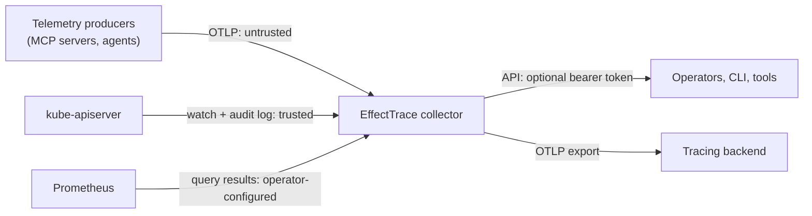

# Threat model

This document lists the threats EffectTrace v0.1 considers, the mitigations
implemented in code, and the residual risk an operator must handle. It
complements the [security model](security-model.md) (trust boundaries and
deployment guidance) and [privacy](privacy.md) (data minimization).

**EffectTrace is an observability system, not an authorization system.** It
records what it observed with an explicit evidence class. It does not prevent,
approve or block any action, and a graph must never be used as an access
control decision.

## Assets

- **Integrity of effect graphs**: an operator must not be shown an attribution
  that the evidence does not support.
- **Confidentiality of cluster metadata**: object names, identities, Event
  notes and signal values.
- **Availability of the collector** under hostile or excessive input.
- **The operator's terminal and browser** when rendering graph data.

## Trust boundaries

The kube-apiserver (its watch API and its audit log) is the trusted source of
truth. OTLP input is untrusted: anyone who can reach the receiver can send
spans. Prometheus is trusted only as far as the operator who configured it.

## Threats and mitigations

| Threat | Mitigation in v0.1 | Residual risk / operator action |
| --- | --- | --- |
| **Forged telemetry** (a producer sends spans claiming a tool call made a change) | A client span alone never establishes a target beyond what the response metadata says, and an audit event is used as confirmation only when it agrees with the span on verb, resource, subresource, namespace and name. A disagreeing audit ID is refused and a graph note says so (lab experiment L30). Controller fan-out follows only watch-observed ownership by UID. | A producer that can reach the receiver can still create fake tool-call actions and fake client spans with plausible UIDs. Restrict the receiver with network policy and forward only from collectors you control. |
| **Spoofed trace IDs** | Trace and span IDs must be non-zero lowercase hex of the right length; parent/child is followed only within one trace and at most 32 hops. Graph IDs derive from trace and span IDs but every graph is built only from stored, validated records. | A producer can reuse another trace's ID and add spans to it. This can add requests to that trace's tool call; audit agreement still applies. Treat `TRACE_LINK` evidence as only as trustworthy as your producers. |
| **Spoofed Audit-IDs** | `k8sinstrument` never sets the `Audit-ID` request header, because kube-apiserver accepts client-supplied values without validation (kubernetes/kubernetes #127801, #101597). It only reads the server's response header, and the audit event must agree with the span. | A client outside EffectTrace's control can still choose its own Audit-ID. Agreement checks limit the damage to requests that match in verb and target. |
| **Malicious baggage** | Baggage is not part of an OTLP span and EffectTrace never reads it. The demo tool server extracts baggage into the context but records none of it. | none known |
| **Sensitive MCP arguments** | Tool arguments and results (`gen_ai.tool.call.arguments`, `gen_ai.tool.call.result`) and every non-allowlisted attribute are dropped at ingest, even when a producer opted in. | Arguments may still reach your tracing backend through other pipelines; configure producers accordingly. |
| **Audit-log leakage** | The audit parser keeps metadata only; never request/response bodies, request URIs or source IPs. Human usernames are pseudonymized with a keyed HMAC. The recommended audit policy level is `Metadata`. | The audit log file itself is readable by the collector (as UID 0, read-only mount). Protect the node and the recording file. |
| **Secret exposure** | The collector's ClusterRole grants no access to Secrets or ConfigMaps; they are never watched. The audit policy at `Metadata` never writes Secret contents. | An audit policy that logs `Request` or `RequestResponse` for Secrets would put contents in the log file; EffectTrace would not retain them, but the file would contain them. |
| **Cross-namespace information exposure** | Graphs include objects from the namespaces the action touched and exclusions from those namespaces. `--namespaces` limits what is watched. | The API has no per-namespace authorization: anyone who can query it sees every graph. Put it behind an authenticating proxy and restrict access to people allowed to read the cluster's audit data. |
| **Untrusted telemetry producer** | Relevance filter (only MCP tool calls and Kubernetes client spans), attribute allowlist, strict validation, bounded store. | See forged telemetry. |
| **Graph poisoning** (inject observations to attach or detach effects) | Attachment requires a single claimant; competing claims become ambiguities instead of attachments. No-op requests never claim fan-out. Watch and audit data, which a telemetry producer cannot write, decide object changes and ownership. Unknown fields are rejected when reading graphs; grades and edge IDs are recomputed and verified. | A forged tool-call span that names a real request with agreeing audit data could duplicate that request's attribution in a second graph; both graphs show the request's sources and coverage. |
| **High-cardinality DoS** | All store collections are bounded by count and age (see [architecture](architecture.md#store-bounds)); at most 64 observations per object; at most 50 exclusions per graph. Metric labels are bounded; no IDs are labels. | Sustained floods evict older observations, which reduces coverage for older actions. |
| **Event flood** | Events are deduplicated by UID (series updates keep the first time and latest count) and bounded (50 000). The ingest queue is bounded; informers block instead of growing memory. | A flood delays ingestion of other sources sharing the queue. Monitor `effecttrace_queue_depth`. |
| **Oversized attributes and payloads** | OTLP bodies are limited to 8 MiB compressed and decompressed, 10 000 spans per request; attribute keys to 128 bytes, values to 512 bytes, 32 attributes and 16 links per span; audit lines to 1 MiB; response metadata peeks to 4 MiB; Prometheus responses to 8 MiB; graphs to 16 MiB. Values over a limit are rejected, not truncated. | none known |
| **Malicious resource names** | Kubernetes names in stored records are length-bounded and must be valid UTF-8 without control characters. Names substituted into PromQL must match DNS-1123. Rendering strips control characters again. | Unicode look-alike names are displayed as-is. |
| **SSRF** | No user-supplied URL is fetched at runtime. The Prometheus URL and the OTLP export endpoint are operator configuration (flags). API path parameters are validated (`^[A-Za-z0-9._:-]{1,200}$` for action IDs, 32 lowercase hex for trace IDs). | Whoever controls the collector's flags controls its outbound connections. |
| **PromQL injection** | Only `$namespace` and `$workload` are substituted, and only with DNS-1123 values; anything else is refused before the query is built. | Signal files are trusted operator input. |
| **Dashboard XSS** | API JSON is encoded with HTML escaping (`<`, `>`, `&` become `<`, `>`, `&`), served as `application/json` with `X-Content-Type-Options: nosniff` and `Content-Security-Policy: default-src 'none'`. The project website renders data with DOM text APIs (`textContent`); `scripts/site_check.py` rejects `innerHTML` assignments (lab experiment L30 sends HTML tool names). | Third-party dashboards that render graph strings as HTML must escape them. |
| **Terminal escape injection** | Stored strings may not contain control characters; the text, DOT and Mermaid renderers strip control characters (including ANSI escape sequences) from every graph-provided string and bound their length, because an exported graph file may come from an untrusted source. | none known |
| **Tampered results** | `model.UnmarshalGraph` rejects unknown fields, trailing data, dangling edges, evidence that does not match the relationship, and incorrect edge IDs, and recomputes grades. Recordings are revalidated record by record on replay; invalid lines are skipped and counted (replay experiment R07). Published experiment numbers are generated from `test-results/*.json`, never typed by hand. | Graph files and recordings are not signed. Verify provenance through the repository's signed commits. |
| **Unauthorized graph queries** | `--api-token-file` requires a bearer token on `/api/*`, compared in constant time. | There is no built-in TLS, user identity or authorization. `/healthz`, `/readyz` and `/metrics` are unauthenticated. Use network policy and an ingress or proxy that terminates TLS and authenticates users. |

## Out of scope for v0.1

- Compromise of kube-apiserver, the node running the collector, or the audit
  log file.
- A malicious cluster administrator.
- Confidentiality of data after it is exported to a tracing backend.
- Proving that an action *caused* an effect. EffectTrace records
  evidence-graded relationships; see [limitations](limitations.md).

## Reporting

Report vulnerabilities privately as described in [SECURITY.md](../SECURITY.md).
